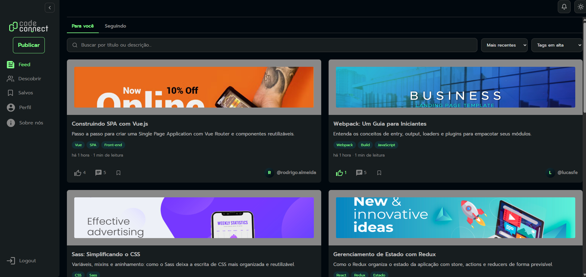

# Code Connect



## 📖 Sobre

**Code Connect** é uma rede social para desenvolvedores, onde a comunidade e o código se unem. Os usuários publicam artigos sobre programação em Markdown, interagem por meio de comentários e curtidas, salvam posts para ler depois, seguem outras pessoas e acompanham tudo por um feed personalizado e um sistema de notificações.

O projeto é dividido em duas partes: um **frontend** SPA em React + Vite e um **backend** REST em NestJS + Prisma, com autenticação segura via tokens JWT em cookies `httpOnly`, documentação interativa (Swagger) e banco SQLite sem dependências externas.

---

## ✨ Funcionalidades

O **Code Connect** oferece uma experiência completa de rede social para quem cria e consome conteúdo sobre programação:

- 📝 **Posts em Markdown**
  - Crie, edite e exclua artigos com capa, título, corpo em Markdown e tags.
  - Rascunhos (`DRAFT`) e publicados (`PUBLISHED`).
  - Página de detalhe com renderização de Markdown e contadores de curtidas e comentários.

- 🏠 **Feed com Filtros e Ordenação**
  - Listagem paginada de posts publicados.
  - Filtre por "todos" ou apenas de quem você segue, busque por texto e filtre por tag.
  - Ordene por mais recentes ou mais populares.

- 💬 **Comentários e Respostas**
  - Comente posts e responda a outros comentários (threads de 1 nível).
  - Curta comentários (toggle).

- ❤️ **Curtidas e Bookmarks**
  - Curta/descurta posts e comentários.
  - Salve posts para ler depois na área de salvos.

- 👥 **Perfis e Conexões**
  - Perfil público com bio, avatar, contadores de conexões e gráfico de atividade dos últimos 12 meses.
  - Descubra e busque pessoas, siga e deixe de seguir usuários.

- 🔔 **Notificações**
  - Receba notificações de curtidas, comentários e novos seguidores.
  - Contador de não lidas e marcação como lidas (individual ou em massa).

- 🖼️ **Upload de Imagens**
  - Envio de avatares e capas de posts (PNG, JPG, WEBP ou GIF até 5MB).

- 🔒 **Autenticação Segura**
  - Registro e login com tokens JWT (access + refresh) em cookies `httpOnly`.
  - Renovação automática de sessão, rate limiting e hardening de cabeçalhos (Helmet).

- 📱 **Experiência Responsiva**
  - Interface SPA fluida, adaptada para desktop e mobile.

---

## 🚀 Tecnologias Utilizadas

### Frontend
- **[React 19](https://react.dev/)**: Biblioteca para construção da interface.
- **[Vite 7](https://vite.dev/)**: Build tool e servidor de desenvolvimento com proxy para a API.
- **[React Router 7](https://reactrouter.com/)**: Roteamento do SPA.
- **[react-markdown](https://github.com/remarkjs/react-markdown)**: Renderização de conteúdo em Markdown.

### Backend
- **[NestJS 11](https://nestjs.com/)**: Framework Node.js para APIs escaláveis.
- **[Prisma 6](https://prisma.io/)**: ORM para TypeScript.
- **[SQLite](https://sqlite.org/)**: Banco de dados local em arquivo — sem dependências externas.
- **[JWT](https://jwt.io/)** + **[bcrypt](https://www.npmjs.com/package/bcrypt)**: Autenticação e hash de senhas.
- **[Swagger](https://swagger.io/)**: Documentação interativa da API (`/api`).
- **[Helmet](https://helmetjs.github.io/)** + **[Throttler](https://docs.nestjs.com/security/rate-limiting)**: Segurança e rate limiting.
- **TypeScript** em todo o backend.

---

## ⚙️ Como Executar o Projeto

O projeto tem duas partes que rodam juntas: o **backend** (API, porta `3000`) e o **frontend** (SPA, porta `5173`). Em desenvolvimento, o Vite faz proxy das rotas da API para o backend, deixando front e API na mesma origem.

### Pré-requisitos

- [Node.js](https://nodejs.org/en) (versão 18 ou superior)
- [npm](https://www.npmjs.com/)

### 1. Clone o repositório

```bash
git clone <url-do-repositorio>
cd codeconnect-platform
```

### 2. Backend

```bash
cd backend

# Instale as dependências
npm install

# Configure as variáveis de ambiente
cp .env.example .env

# Gere o banco SQLite, aplique as migrações e popule com dados de exemplo
npx prisma migrate dev
npx prisma db seed

# Suba a API em modo desenvolvimento
npm run start:dev
```

A API estará disponível em `http://localhost:3000` e a documentação Swagger em `http://localhost:3000/api`.

> Consulte o [README do backend](./backend/README.md) para detalhes de endpoints, segurança e modelos de dados.

### 3. Frontend

Em outro terminal:

```bash
cd frontend

# Instale as dependências
npm install

# Suba o SPA em modo desenvolvimento
npm run dev
```

A aplicação estará disponível em `http://localhost:5173`.

### 4. Acesse com um usuário de exemplo

Após o seed, use qualquer um dos usuários criados (senha padrão `Code1234`):

- `rodrigo@codeconnect.dev`
- `marina@codeconnect.dev`
- `rafael@codeconnect.dev`
- `juliana@codeconnect.dev`
- `pedro@codeconnect.dev`
- `camila@codeconnect.dev`
- `lucas@codeconnect.dev`

---

## 📜 Scripts

### Backend (`/backend`)

| Script                | O que faz                                   |
| --------------------- | ------------------------------------------- |
| `npm run start:dev`   | API em modo desenvolvimento (hot-reload)    |
| `npm run build`       | Build de produção                           |
| `npm run start:prod`  | Serve o build de produção                   |
| `npm run lint`        | ESLint (com `--fix`)                        |
| `npm run test`        | Testes unitários (Jest)                     |
| `npx prisma studio`   | Interface gráfica para visualizar o banco   |
| `npx prisma db seed`  | Popula o banco com dados de exemplo         |

### Frontend (`/frontend`)

| Script            | O que faz                              |
| ----------------- | -------------------------------------- |
| `npm run dev`     | Servidor de desenvolvimento (Vite)     |
| `npm run build`   | Build de produção                      |
| `npm run preview` | Serve o build de produção localmente   |
| `npm run lint`    | ESLint em todo o projeto               |

---

## 📁 Estrutura do Repositório

```
codeconnect-platform/
├── backend/     # API REST (NestJS + Prisma + SQLite)
└── frontend/    # SPA (React + Vite + React Router)
```
